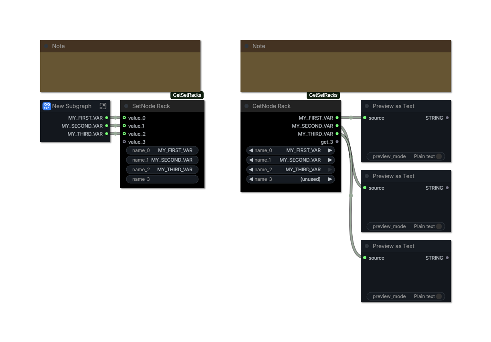

# ComfyUI-GetSetRacks

 Frontend-only nodes that publish or read many named variables at once: a rack of setters, and a rack of getters.

 Intended to be used with [ComfyUI-KJNodes](https://github.com/kijai/ComfyUI-KJNodes), which provides the indivudal `Get`/`Set` node variants.

  ## Why racks

 ComfyUI's editor gets slower as a graph grows, and `Set` nodes are cheap to add and expensive to live with:

 - **Node count.** Editor work - drawing, hit-testing, change tracking, serialising, undo snapshots - scales with the number of nodes. A single rack greatly reduces the passive burden on the graph.

 - **Screen real estate.** An individual `Set` node cannot be collapsed into a block with its neighbours; each one costs its own title bar and body. A rack spends one title bar for the whole group and one line per variable.

 Racks resolve exactly like `Set` node names, so existing `Get` nodes keep working: replace the old setters rather than leaving both, because two setters publishing one name in scope is ambiguous.

 ## Nodes

| Node | Node id | What it does |
| --- | --- | --- |
| **SetNode Rack** | `SetNodeRack` | Publishes several values. Each row is named after the output feeding it, so it follows a renamed output. |
| **SetNode Rack (Editable)** | `SetNodeRackNamed` | Publishes several values, each named only by its own text field. |
| **GetNode Rack** | `GetNodeRack` | Reads several variables. Each row picks a name and outputs its value. |

The standard rack follows the output it reads. A row fed by a subgraph output shows that output's label and keeps it in sync: rename the output and the variable is renamed with it. Rows fed by something that has no authored name (a plain node's `IMAGE` or `INT` slot) keep their own editable field instead, which is what lets a row publish `UPLOADED_IMAGE` from a `Load Image`.

 Use **SetNode Rack (Editable)** when a row's variable name must differ from its output's name either because the output has no usable name, or because the same output feeds two differently named variables. Nothing on that node is ever filled in or rewritten for you.

 ## Usage

 1. Add a **SetNode Rack** node. Drag a value onto its body to create the next row, or use right-click → **Add row**. Right-click → **Remove unused rows** tidies spare rows.

 2. Rows name themselves from the outputs feeding them. Where the name should differ, name the output (that keeps the whole graph consistent), or put that row on a **SetNode Rack (Editable)** node and type it there.

 3. Read the value with a `Get` node, or with a **GetNode Rack** when one node should read several variables. Both resolve names in the current graph and its ancestors.

 A getter row offers the same names a `Get` node offers from that spot: every `Set` node and rack row visible in the current graph and its ancestors, sorted, with `(parent)` appended to names that live in an ancestor graph. Each row is filtered by the type of the input its output feeds, the way `Get` filters its own list, so a row feeding a `MODEL` input will not offer `INT` variables. Turn off **KJNodes → Filter Get node options** to list every name in scope.

 ### Converting a column of Get nodes

 Select two or more `Get` nodes, then either

 - right-click **one of the selected nodes** → **Convert N Get nodes to GetNode Rack**, or - right-click **empty canvas space** while that selection is active (the canvas menu).

 Both entries run the same command. The rack replaces the nodes in place: rows follow reading order (top to bottom, then left to right), and every consumer keeps the value it already read because each Get's links move onto its row before the Get is removed. The prompt the frontend builds is unchanged - only the node count is.

 Use it on the panels that grew one Get per variable; a single Get is clearer as it is.

 The rack always keeps one blank trailing row available for the next connection. That spare is UI-only and is omitted when the workflow is saved; loading the workflow recreates it. All row sockets render as optional because an unused row never makes the graph invalid.

 Every row's name is also injected into KJNodes' `Get` node Constant CHOICE list using the same graph scope and connection-type filtering as regular `Set` node names. A getter rack's own dropdown lists the same names, plus **(unused)** - choosing it clears the row, so a row can be retired without deleting the node.

 Retiring a getter row drops whatever that row's output fed and closes the rows below it up, so every other consumer keeps reading its own variable. The row list always ends with one spare row; that spare is UI-only and is not saved.

 ## How it works

 The racks are registered in the frontend only (Python stubs exist so they are real node types), exactly like KJNodes' `Set`/`Get`. Because KJNodes resolves names by scanning for nodes whose type is `SetNode`, this extension wraps `GetNode.getInputLink` and `GetNode.resolveVirtualOutput` to consult racks first and delegate every other lookup to KJNodes unchanged. Both hooks are wrapped defensively: a failed lookup logs a warning and falls through, so an unrelated graph behaves exactly as before.

 During workflow loading, serialized row sockets are normalized to `value_0 ... value_(n-1)` for the setters and `get_0 ... get_(n-1)` for the getter before ComfyUI merges them with the schema's declared socket. This keeps old variable-named racks from acquiring an extra socket while preserving their link order.

 Rather than autogrow, the extension owns the row list. ComfyUI's V3 autogrow forces a widget template into a socket, so an autogrow row could not carry the name field a setter row needs or the name chooser a getter row needs, and its positional socket renames cannot line up with per-row fields.

 The command is registered through the frontend's `getNodeMenuItems` and `getCanvasMenuItems` hooks rather than by monkey-patching `LGraphCanvas`, which the frontend deprecated. That is also why it appears in two menus: the frontend builds the node menu (right-click a node) and the canvas menu (right-click empty space) from separate hooks.

 ## Requirements

 [ComfyUI-KJNodes](https://github.com/kijai/ComfyUI-KJNodes) for its `GetNode`. A getter rack reads `Set` node names too, but only a rack-published name is needed by itself. Without KJNodes the racks still render and `GetNode Rack` still resolves rack rows; the extension logs a warning on load.

 ## Install

 Copy this folder into `ComfyUI/custom_nodes` and restart ComfyUI. No Python dependencies, no inference nodes, no workflow format changes.

 ## Limits

 - The published name is the row's identity, so two racks must not publish the same name in one scope.

 - Racks cannot be seen from a sibling subgraph, matching KJNodes' downwards-only scope.

 - An instance input socket can be overridden per instance; a variable read cannot. If two instances of one subgraph need different values, keep a socket for that value.

 - A label-derived row follows its upstream label. Give that row a custom name by using **SetNode Rack (Editable)** instead, or by labelling the output it reads.

 - A row whose output is a subgraph output cannot hold a name of its own; two rows reading one output cannot publish two different names. Use the Editable rack for either case.

 - A rack holds up to 99 rows.

 ## Tradeoffs

 ComfyUI's convention is explicit links, and `Set`/`Get` indirection hides wires either way. A rack is still indirection; it just spends one node and one visible column instead of twelve. Reach for a rack when a panel reads many values that already exist elsewhere in scope, and for a direct link when a value has exactly one consumer — hiding a single wire behind a rack is a poorer trade than running it.

 Stock ComfyUI has no first-party `Set`/`Get` (as of September 2026, the core node list still does not contain them), so this pack is an addition to the KJNodes convention, not a first-party feature: it resolves `Set` node names as well, and existing `Get` nodes work unchanged.